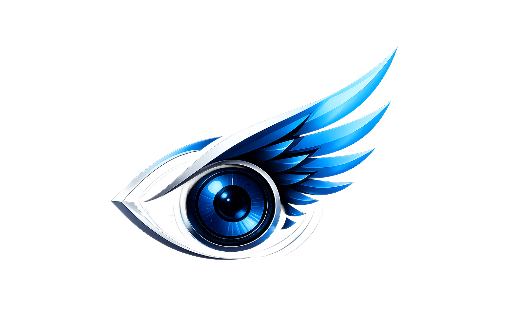

# [🛡️ Sky Vision – Smart Security Solutions](https://med0112.github.io/SkyVision/HomePage.html)

[](https://github.com/med0112/SkyVision/stargazers)
[](https://github.com/med0112/SkyVision/network)
[](LICENSE)
[](https://med0112.github.io/SkyVision/HomePage.html)
[](https://firebase.google.com/)

---

[](https://med0112.github.io/SkyVision/HomePage.html)

**Sky Vision** is a fully integrated website for a leading Algerian company specializing in surveillance systems and smart security solutions. The site features a modern, responsive interface showcasing services, projects, client testimonials, and a direct contact form — all powered by a complete admin panel that dynamically controls content via Firebase.

---

## 🚀 Key Features

- **Modern & Responsive Design** – Works perfectly on all devices.
- **Random Background Video** – Changes automatically on each page load.
- **Auto-changing Images** – In the "About" section, images rotate every 5 seconds.
- **Fully Dynamic Content** – All text and data are pulled from Firebase, easily updated via the admin panel.
- **Complete Admin Dashboard** – Allows the admin to:
  - Edit Hero section content: badge, title, description, button texts.
  - Edit "About Us" section: titles, descriptions, statistics.
  - Manage services, projects, and client testimonials (add, edit, delete).
  - View and manage incoming messages from the contact form.
  - Update contact information and social media links.
- **Contact Form** – Sends messages directly to Firebase Firestore.
- **Firebase Integration** – Uses Authentication, Firestore, and Analytics.

---

## 🛠️ Tech Stack


---

## 📂 Project Structure

```
Sky_Vision/
├── videos/                # Background videos (v1.mp4, v2.mp4, ...)
├── images/                # "About" section images (1.jpg, 2.png, ...)
├── HomePage.html          # Main website page
├── admin.html             # Admin dashboard
├── logo.png               # Company logo
└── README.md              # This file
```

---

## 🖥️ Live Demo

[](https://med0112.github.io/SkyVision/HomePage.html)

---

## 🧪 How to Run Locally

1. **Clone the repository**
   ```bash
   git clone https://github.com/med0112/SkyVision.git
   cd SkyVision
   ```

2. **Set up Firebase**
   - Create a project in [Firebase Console](https://console.firebase.google.com/).
   - Enable **Authentication** (Email/Password).
   - Create a **Firestore** database.
   - Copy your `firebaseConfig` and replace it in `HomePage.html` and `admin.html`.

3. **Create an Admin Account**
   - Use the provided `create_admin.py` Python script, or manually create a user in Firebase Console and add a `role: "admin"` field in the `users` collection.

4. **Run the project**
   - Use any local server (e.g., Live Server in VS Code) to open `HomePage.html`.

---

## 👥 Contributors

- **Merkhoufi Dalal** – Project Lead

---

## 🤝 Contributing

Contributions are welcome! If you find a bug or have a suggestion:

1. Open a new **Issue**.
2. **Fork** the project.
3. Submit a **Pull Request** with a clear description of your changes.

---

## 📄 License

This project is licensed under the [MIT License](LICENSE) – you are free to use and modify it.

---

## 📞 Contact

- **Email:** skyvision2233@gmail.com
- **Website:** [Sky Vision](https://med0112.github.io/SkyVision/HomePage.html)

---

> *Developed by the Sky Vision Team – Algeria 🇩🇿*  
> *Project Lead: Merkhoufi Dalal*
```

---

## 📊 Comparison Table

| Aspect | Before | After |
|--------|--------|-------|
| **Visual Appeal** | Plain text | Badges, icons, colored labels |
| **Structure** | Basic sections | Clear hierarchy with dividers and emojis |
| **Tech Stack** | Table only | Icons + badges |
| **Live Demo** | Plain link | Button-style badge |
| **Contributors** | Not shown | Clearly listed |
| **License** | Mentioned only | Badge included |
| **Engagement** | Standard | More interactive and readable |

---
